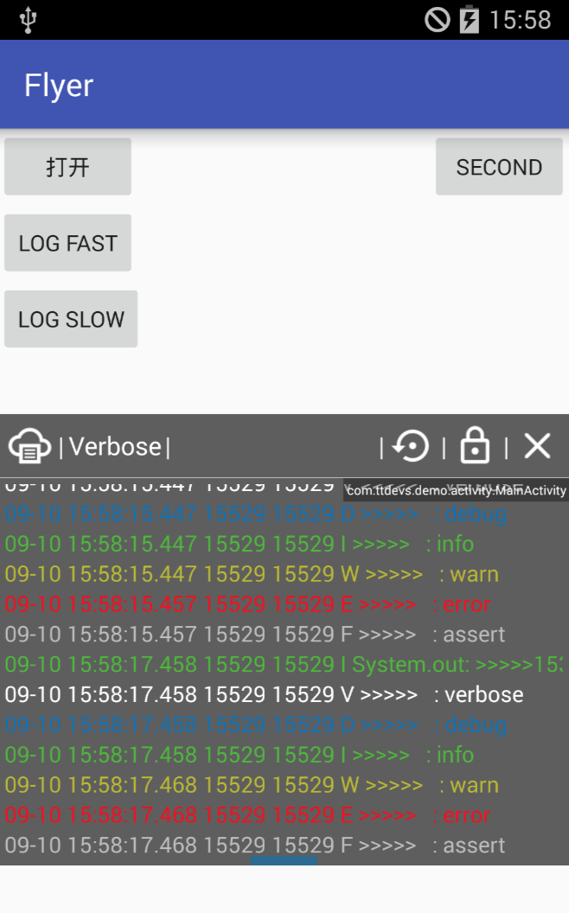
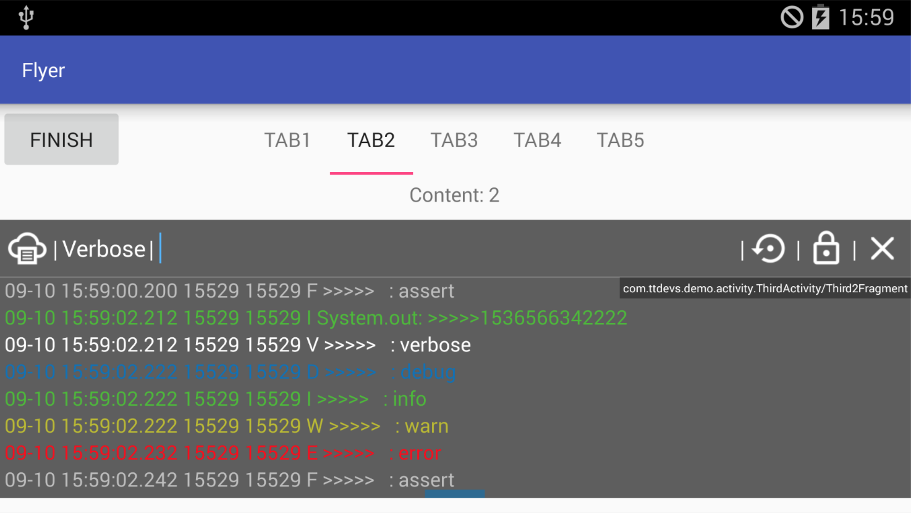

# Flyer

一个在界面上展示Logcat日志信息的工具类。

## 使用

- 引用：

    `implementation "com.ttdevs:flyer:0.1.0"`
    
    > 当 support 版本不兼容时: `implementation "com.ttdevs:flyer:0.1.0@aar"`

- 混淆：

    `-keep class android.app.ActivityThread{ public *;}`
    
- 使用：

    - 打开：`Flyer.show();`
    - 关闭：`Flyer.dismiss();`

- 操作：

    - ：上下移动窗口
    - ：清空日志
    - ：打开/关闭自动滚动
    - ：关闭窗口

## 功能

- Demo: [app-debug.apk](docs/app-debug.apk)
- 已经完成
    - 展示Logcat
    - 设置Log级别
    - 不同级别日志显示不同颜色
    - 移动窗口位置
    - 清空展示窗口
    - 打开/锁定日志滚动
    - 展示当前Activity/Fragment(暂支持v4)
    - 调整窗口高度
    - 通过关键字过滤日志
    
- TODO
    - 保存日志
    - 拷贝日志
    - 混淆
    - ...

- Bug
    - Flyer显示后会屏蔽其他输入框
    - 魅族Note5 7.1.1 不能显示
    - Samsung SCH-I545 4.4 显示后Home键和返回键不能用

## Other

 - App中图片来自 [Material Design Icons](https://materialdesignicons.com/)，在此表示感谢
    - hdpi：
    - xhdpi：大小72，内容64
    - xxhdpi：
    
## 感谢

感谢[磊神](https://github.com/lchen1991)提供的支持，帮助解决搜索和拷贝的问题

## Reference

- [UETool](https://github.com/eleme/UETool)
- [ActivityTaskView](https://github.com/rome753/ActivityTaskView)
- [Logcat](https://developer.android.com/studio/command-line/logcat)

## License

[MIT](LICENSE)
